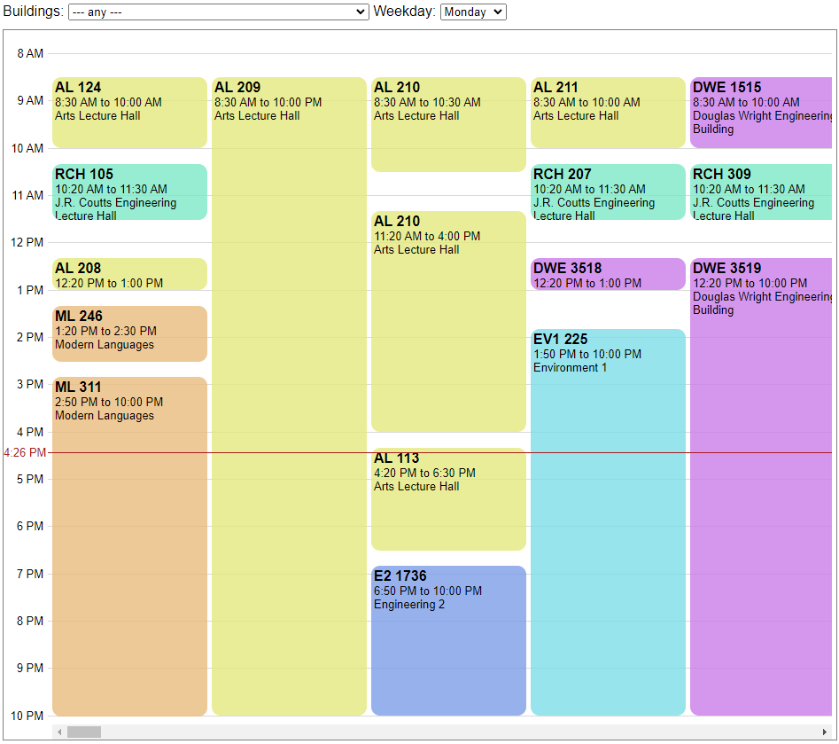
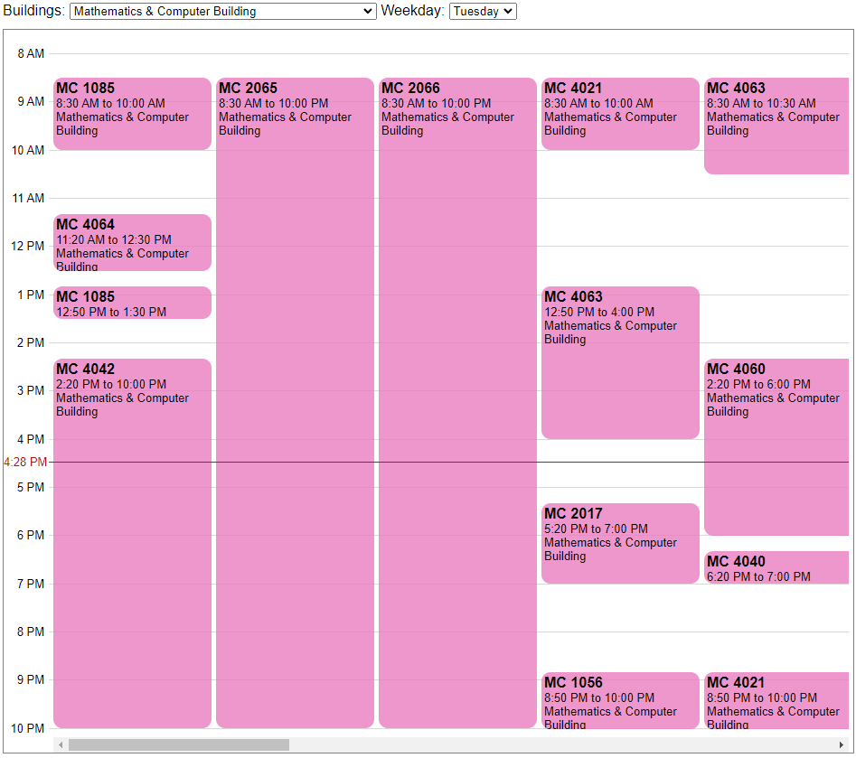

# FreeRoom
Find an open classroom in the University of Waterloo

# How to use
1. Select a building and get open classroom schedule.
2. Select the day of the week.
3. Find a room at the time you need!

Here is what the schedule viewer looks like!

Here is another example.

### Note
Not every weekday is available. The API only provides open classrooms for the next two school days.

